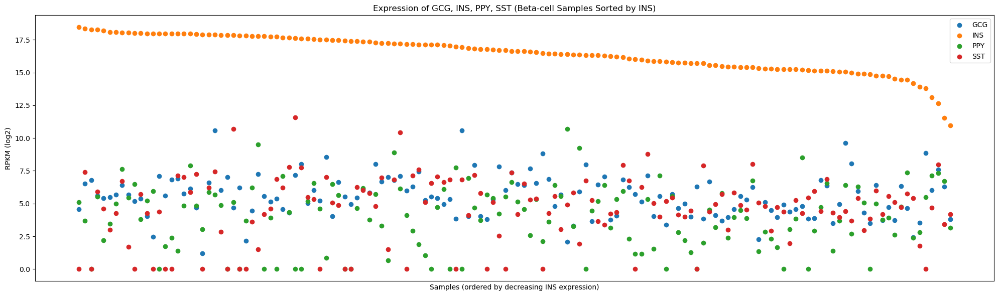
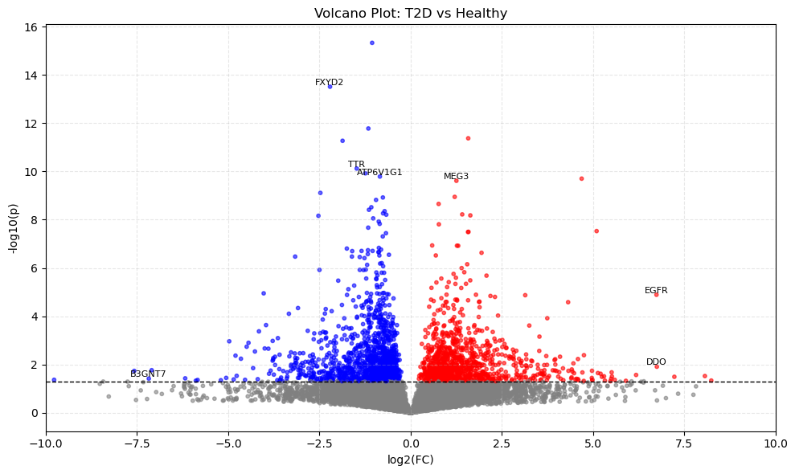
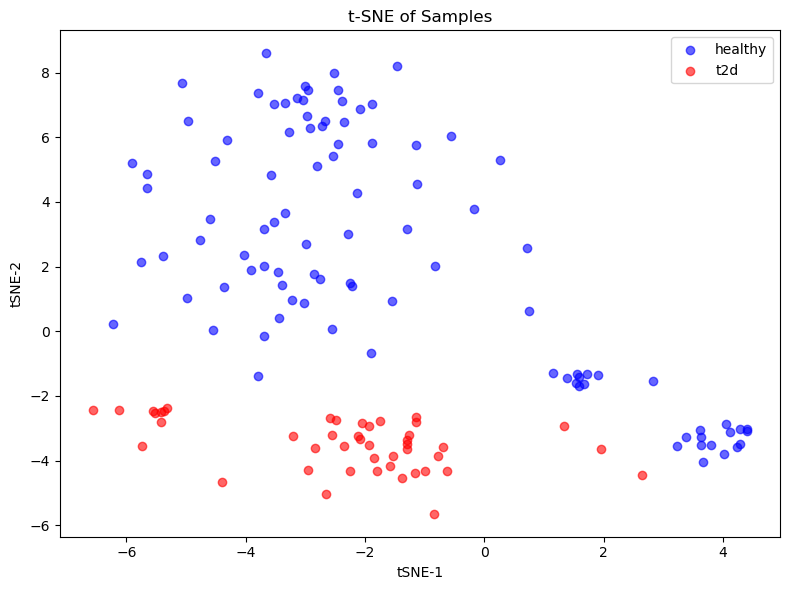
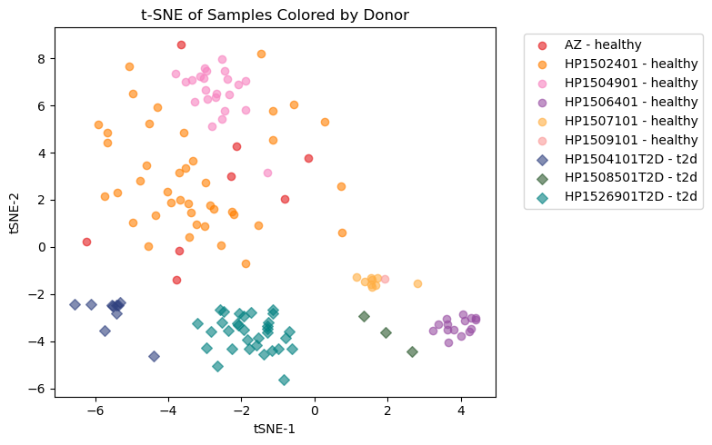
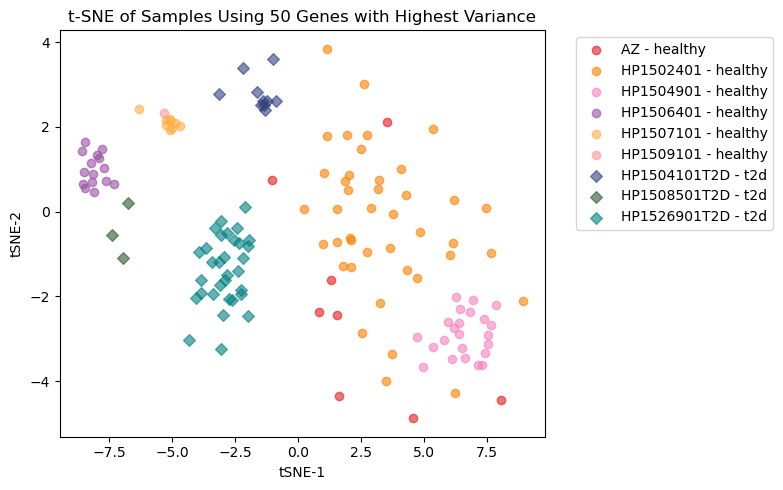
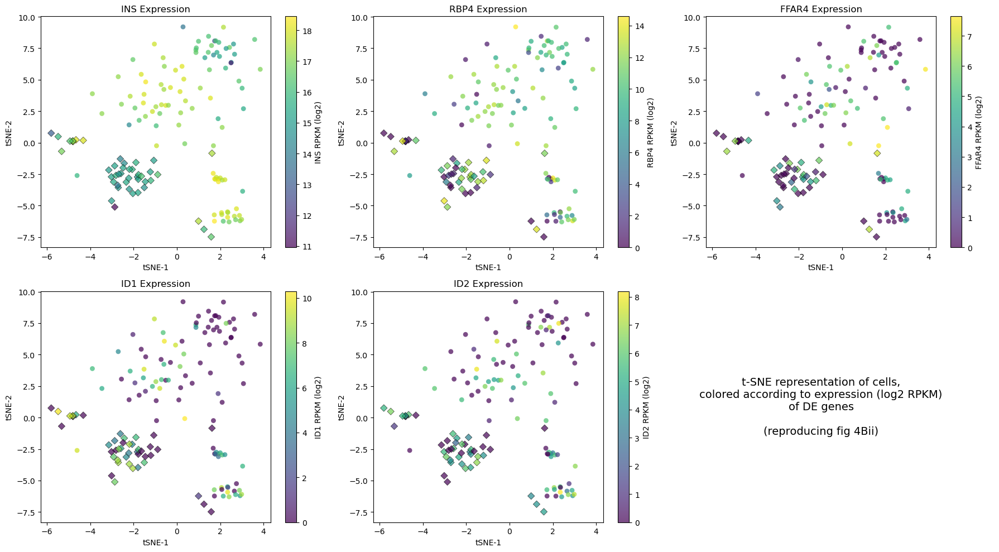
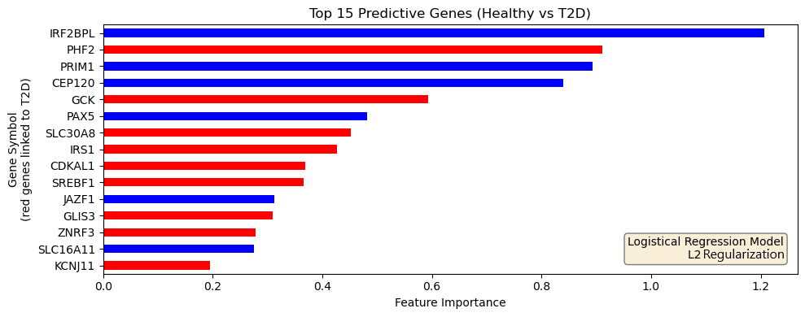

# Analysis Report: β-cell Transcriptomics in Type 2 Diabetes

Reproduction of Segerstolpe et al. (2016) — *Single-Cell Transcriptome Profiling of Human Pancreatic Islets in Health and Type 2 Diabetes* — with extended machine learning analysis.

## Dataset

| Property | Value |
| --- | --- |
| Samples | 142 β-cell samples (97 healthy, 45 T2D) |
| Donors | 6 total (3 healthy, 3 T2D) |
| Raw genes | 62,710 |
| Genes after filtering (expressed in ≥5 samples) | 16,361 |
| Normalization | RPKM (edgeR) |
| Reference genome | GRCh38, Ensembl Release 109 |

Sex distribution is unbalanced: 5M:1F healthy donors, 2M:2F T2D donors. This is inherited from the original study and limits certain interpretations (see [Limitations](#limitations)).

---

## 1. β-cell Marker Validation

Before comparing conditions, we confirmed that our filtered samples are genuinely β-cells by examining expression of four canonical pancreatic islet markers.

**Mann-Whitney U test results** (healthy vs. T2D):

| Gene | Role | U-statistic | p-value | Direction in T2D |
| --- | --- | --- | --- | --- |
| INS | Insulin | 3438.00 | 3.74 × 10⁻⁸ | ↓ Significantly lower |
| GCG | Glucagon | 3367.00 | 2.09 × 10⁻⁷ | ↓ Significantly lower |
| SST | Somatostatin | 2689.00 | 0.026 | ↓ Significantly lower |
| PPY | Pancreatic polypeptide | 2617.00 | 0.057 | Not significant |

Both insulin and glucagon expression are significantly reduced in T2D samples, consistent with the known impairment of hormone secretion in T2D β-cells. This reproduces the central finding of Segerstolpe et al. and validates the sample classification.

---

## 2. Differential Expression

We performed Welch's t-test on log2-transformed RPKM values across all 16,361 filtered genes. Significance was defined as p < 0.05 with |log2 fold change| > 1.

**Thresholds:** log2FC > 1 (upregulated in T2D, red) or log2FC < −1 (downregulated in T2D, blue). Gray points are not significant.

Notable differentially expressed genes include EGFR (upregulated in T2D), FXYD2, TTR, and MEG3, alongside several antisense and long non-coding RNAs. Gene ID mapping was performed via the MyGeneInfo API (61,474 / 62,710 Ensembl IDs successfully resolved, 98.0%).

---

## 3. Dimensionality Reduction

### t-SNE by Condition

t-SNE was applied to 30 PCA components of log2(RPKM + 1) values (perplexity = 30). Samples are colored by health condition.

Healthy and T2D β-cells occupy partially distinct regions of the embedding, suggesting transcriptome-wide differences between conditions beyond individual marker genes.

### t-SNE by Donor

The same embedding colored by individual donor.

Donor-level clustering is visible, particularly for T2D donors. This indicates that inter-donor variability is a substantial source of transcriptomic variation — a known challenge in single-cell studies with small donor cohorts.

### t-SNE on 50 Most Variable Genes

Repeating the embedding using only the top 50 most variable genes isolates the dominant sources of variation.

---

## 4. Spatial Gene Expression on t-SNE

Expression levels of five biologically relevant genes are overlaid on the t-SNE coordinates (reproduced from Figure 4B of Segerstolpe et al.).

Genes shown: INS, RBP4, FFAR4, ID1, ID2. Coloring reflects normalized expression level per gene (low → high). INS expression tracks with condition, while RBP4 and FFAR4 show more donor-specific patterns.

---

## 5. Machine Learning Classification

A logistic regression classifier (L1 penalty, liblinear solver) was trained to distinguish healthy from T2D β-cells using all 16,361 gene expression features.

**Training setup:**

- 70/30 train-test split, stratified by condition
- Training: 99 samples (70 healthy, 29 T2D)
- Test: 43 samples (27 healthy, 16 T2D)
- Features standardized with `StandardScaler`

### Top 15 Predictive Genes

Genes highlighted in red in the bar chart have been independently linked to T2D in the literature. Their presence among the top predictors provides partial validation of the model, though the majority of the top features are not canonical T2D risk genes — suggesting the classifier is capturing broader transcriptomic dysfunction rather than known genetic loci alone.

---

## Limitations

1. **Small donor cohort.** Only 6 donors (3 healthy, 3 T2D). Donor-level batch effects are visible in the t-SNE and may confound condition-level differences.

2. **Sex imbalance.** Healthy donors are predominantly male (5M:1F); T2D donors are more balanced (2M:2F). Sex-linked genes (e.g., RPS4Y1, rank 9 in the classifier) likely reflect this imbalance rather than T2D biology.

3. **Bulk-like analysis.** The pipeline aggregates reads across each sample rather than resolving individual cells within a sample, reducing single-cell resolution compared to modern droplet-based methods.

4. **STAR version.** Alignment used STAR v2.3.0e (project constraint). Current best practice is v2.7+, which includes improved splice junction detection.

5. **Statistical approach.** Welch's t-test on RPKM values is a simplified approach compared to the negative binomial models (e.g., edgeR, DESeq2) typically used for count-based RNA-seq differential expression.
